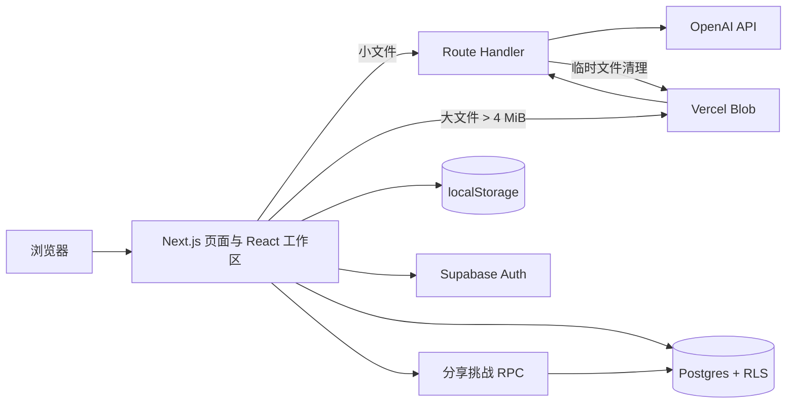
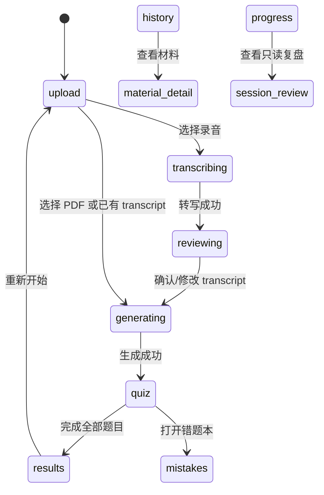

# PaperQuiz AI 技术说明

> 文档版本：2026-08-04  
> 适用代码：当前 `paper-quiz-ai` checkout

## 1. 项目概述

PaperQuiz AI 将课程 PDF 或讲课录音转换为可练习的小测。系统支持选择题、填空题、简答题和自定义题型，并提供逐题评分、错题本、学习历史、进度统计、材料复习单、题目追问和可分享的挑战链接。

应用的原则是：生成、评分和追问都必须以用户提供的学习材料为依据；模型输出通过 Zod schema 校验后才进入前端；题目重复时自动请求一次替换题。

## 2. 技术栈与运行边界

| 层次         | 技术/组件                                      | 责任                                                   |
| ------------ | ---------------------------------------------- | ------------------------------------------------------ |
| Web 框架     | Next.js 15 App Router、React 19、TypeScript    | 页面、Server Component、Route Handler                  |
| AI           | OpenAI Responses API、结构化输出、音频转写 API | 题目生成、书面答案评分、题目辅导、考试复习单、录音转写 |
| 校验         | Zod                                            | 请求参数、题目、评分结果、历史数据的运行时校验         |
| 身份与同步   | Supabase Auth、`@supabase/ssr`、Postgres RLS   | Magic Link/Google 登录及跨设备同步                     |
| 文件传输     | Vercel Blob Client Upload                      | 超过 4 MiB 的学习文件绕过 Function request body        |
| 客户端持久化 | `window.localStorage`                          | 离线优先保存练习会话和错题本                           |
| 导出         | `jspdf`                                        | 学生版、答案版、错题和进度 PDF                         |
| 测试         | Vitest、Testing Library、ESLint、TypeScript    | 单元、Route Handler、组件和类型检查                    |

生产页面入口为 `/`，未登录用户会由 `app/page.tsx` 重定向到 `/login`。所有 OpenAI 密钥只在服务端读取，不能使用 `NEXT_PUBLIC_*` 暴露。

## 3. 总体架构



核心状态机集中在 `components/quiz-workspace.tsx`：



## 4. 核心业务流程

### 4.1 PDF 生成小测

1. `UploadView` 接收 1–5 个 PDF，配置难度和题目结构，总题数上限为 15。
2. 小于等于 4 MiB 的文件直接放入 `FormData`；更大的文件先通过 `/api/study-upload` 获取 Vercel Blob 上传授权。
3. `POST /api/generate-quiz` 校验文件、transcript、题型配置和 OpenAI 配置。
4. 每个 PDF 尝试上传到 OpenAI Files API，设置 7 天过期时间；生成请求通过 `input_file.file_id` 引用文件。若 Files API 不可用，则对对应文件回退为一次性的 base64 内联内容。
5. Responses API 以 `QuizSchema` 结构化输出。`generateDistinctQuiz` 用 `questionKey(type + 规范化 prompt)` 检查重复题；只针对重复题重试一次。
6. 浏览器保存 `sourceFileId(s)`、题目和新建的 `sessionId`，进入逐题答题界面。

### 4.2 录音转题

1. 支持 MP3、M4A、WAV、WebM 和 MP4。
2. `POST /api/transcribe` 调用 `OPENAI_TRANSCRIBE_MODEL`（默认 `gpt-4o-mini-transcribe`），提示模型保留术语、姓名、缩写和公式。
3. 转写成功后先进入 `TranscriptReviewView`，用户可以修改文本，再调用同一套题目生成流程。
4. 处理完毕后删除临时 Blob；不超过 20,000 字符的 transcript 会随会话保存，便于刷新后继续评分。

### 4.3 答题、评分与追问

- 选择题：浏览器直接比较 `correctOptionId`，不发 AI 请求。
- 填空题：浏览器用 `normalizeAnswer`（大小写、标点、连字符和空白归一化）比较 `acceptedAnswers`。
- 简答题/自定义题：`POST /api/grade-answer` 将题目、答案和原始材料发送给 OpenAI，返回 `correct`、`partial` 或 `incorrect`、0–1 分数、反馈及缺失要点。
- 题目追问：`POST /api/question-chat` 最多携带 8 条历史消息；回答被限制在当前题目和学习材料范围内，无法从材料得到答案时必须明确说明。

评分成功或失败都会更新当前会话的答案/评分状态；非正确答案通过内容哈希键写入错题本。

### 4.4 历史、材料和复习单

会话最多保留 30 条。每条会话包含题目、答案、评分、按题目分组的追问记录和 `PersistedSource`。材料使用“文件名 + 文件大小”作为 `materialId`，从而将同一上传材料的会话和错题聚合到 History 详情页。

材料详情页可以：

- 按题目/错题查看记录；
- 仅用该材料的错题重新练习；
- 生成只基于该材料的考试复习单；
- 导出学生版或答案版 PDF。

## 5. API 接口

所有 AI Route Handler 都声明 `maxDuration = 60`，客户端 `postForm` 使用相同的超时边界。

| 方法与路径                                     | 输入                                                            | 输出/用途                                          |
| ---------------------------------------------- | --------------------------------------------------------------- | -------------------------------------------------- |
| `POST /api/study-upload`                       | Vercel Blob Client Upload JSON                                  | 返回上传授权；仅允许项目声明的 PDF/音视频类型      |
| `POST /api/generate-quiz`                      | `files`/`studyBlobs` 或 `transcript`、`questions`、`difficulty` | `title`、`summary`、`questions`、`sourceFileId(s)` |
| `POST /api/transcribe`                         | `file` 或 Blob 描述                                             | `{ transcript }`                                   |
| `POST /api/grade-answer`                       | `question`、`answer`、transcript 或 `fileId(s)`/PDF             | 结构化 `GradeResult`                               |
| `POST /api/question-chat`                      | `question`、`message`、`history`、transcript 或文件引用         | `{ reply }`                                        |
| `POST /api/generate-exam-review`               | 已保存 `fileIds` 或 transcript                                  | 结构化考试复习单                                   |
| Supabase RPC `create_shared_challenge`         | 公共题目、答案键、可选过期时间                                  | 分享 slug；当前 UI 默认 7 天                       |
| Supabase RPC `get_shared_challenge`            | slug                                                            | 仅返回公共题目，不返回答案键或源文件               |
| Supabase RPC `submit_shared_challenge_attempt` | slug、答案、显示名                                              | 客观题得分和逐题结果，并保存尝试记录               |

常用请求上限：transcript 120,000 字符、答案 12,000、追问 2,000、聊天历史 8 条、题目 JSON 50,000 字符、单次最多 5 个 PDF。

## 6. 数据与同步设计

### 6.1 浏览器存储

- `paper-plane-quiz-history-v1`：最多 30 个 `StudySession`。
- `paper-plane-quiz-mistakes-v1`：错题条目、用户答案、评分、来源材料元数据。
- transcript 只有在不超过 20,000 字符时持久化；PDF 二进制不会写入 localStorage。

### 6.2 Supabase 表与安全策略

`20260728000000_paper_quiz_sync.sql` 创建：

- `paper_quiz_sessions(user_id, id, payload, updated_at)`；
- `paper_quiz_mistakes(user_id, id, payload, updated_at)`。

两张表启用 RLS，策略要求 `auth.uid() = user_id`，并只向 `authenticated` 授予 CRUD 权限。

`20260729000000_shared_challenges.sql` 创建分享挑战、答案键和尝试记录三张表。答案键仅所有者可访问；公共读取和提交通过 `security definer` RPC 完成，RPC 会检查 active/expiration，且公共响应不包含答案键。

### 6.3 同步算法

`useStudySync` 采用“localStorage 离线优先 + 认证后合并”：

1. 登录后并行读取当前用户的远端会话和错题。
2. 首次认证将本地记录与远端记录按 `updatedAt` 合并；同一时间戳保留本地副本。
3. 600 ms 防抖后只 upsert 相对上次远端快照发生变化的记录。
4. 只有用户明确删除错题时才删除远端行，避免空集合或旧标签页误删全部数据。
5. 同步到远端前移除 OpenAI `fileId(s)`；这些 ID 绑定上传设备，跨设备恢复后书面题需要重新上传原材料。

## 7. 安全、隐私与可靠性

- OpenAI API Key、Supabase publishable config 和 Blob token 只在各自允许的边界使用；服务端密钥不进入客户端 bundle。
- Blob URL 必须是 HTTPS 且主机名以 `.blob.vercel-storage.com` 结尾；生成/转写完成后删除临时 Blob。
- OpenAI 文件引用设置 7 天 TTL，避免遗留文件无限积累。
- 每个 AI 请求都做输入长度和 schema 校验，模型输出再做 Zod parse；异常统一返回 4xx/5xx JSON 错误。
- 评分和追问 prompt 明确禁止脱离材料编造事实；题目生成要求输出来源页码、章节或 transcript 主题。
- Supabase 表使用 RLS 隔离用户数据；分享挑战的答案键不通过匿名查询暴露。

## 8. 配置与部署

最小环境变量：

```env
OPENAI_API_KEY=...
OPENAI_MODEL=gpt-5.6-luna
OPENAI_TRANSCRIBE_MODEL=gpt-4o-mini-transcribe
OPENAI_BASE_URL=
BLOB_READ_WRITE_TOKEN=...
NEXT_PUBLIC_SUPABASE_URL=...
NEXT_PUBLIC_SUPABASE_PUBLISHABLE_KEY=...
```

Vercel 部署需要先连接 Blob Store，并在项目设置中配置环境变量；Supabase 需要执行两份 migration。Netlify 配置仍保留在 `netlify.toml`，但部署平台的环境变量和 Blob 配置必须分别完成。

## 9. 本地验证

```powershell
npm install
npm test
npm run typecheck
npm run lint
npm run format:check
npm run build
```

没有 `OPENAI_API_KEY` 时，页面和上传界面仍可加载；调用 AI 端点会返回 503，而不是把错误伪装成空题目。

## 10. 当前边界与后续注意事项

- OpenAI 文件引用最多保留 7 天；跨设备同步不会复制文件本身。
- 简答题和自定义题依赖原始材料进行服务端评分；若引用过期或当前设备没有原文件，需要重新上传。
- 选择题与填空题为本地评分，因此刷新后不依赖 AI 服务即可复核。
- 分享挑战只分享题目和必要的答案校验结果，不分享 PDF、录音或 transcript。
- 本文描述的是代码中的实现边界；部署后的环境变量、Supabase migration 状态和第三方配额仍需在目标环境单独核验。
